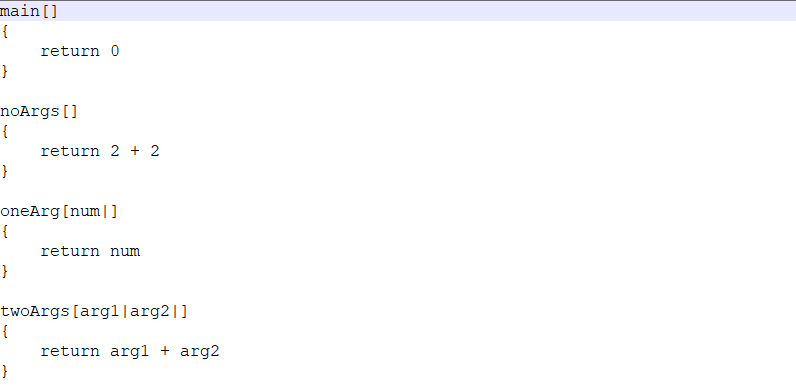

### Language
A simple programming language for my virtual processor.

Each program must contain a main function. To declare a function, type funtion name, function arguments in square brackets and function code in curly brackets. 
Each argument must be followed by | symbol. If function has no arguments, leave square brackets empty. 
Each function must contain return command followed by math expression.

Variables are declared by var command followed by variable name. @ is an assignment operator, math expression on the left is assigned to variable on the right.
read and write commands are used to read and write numbers to variables.

Math operators are addition(+), substraction(-), multiplication(*), division(/), sine(sin), cosine(cos), square root(sqrt) and absolute value(abs).

There are no logical operators. In ifs and whiles, math expression is used as condition. If math expression equals to 0 the condition is false, the condition is true otherwise.
